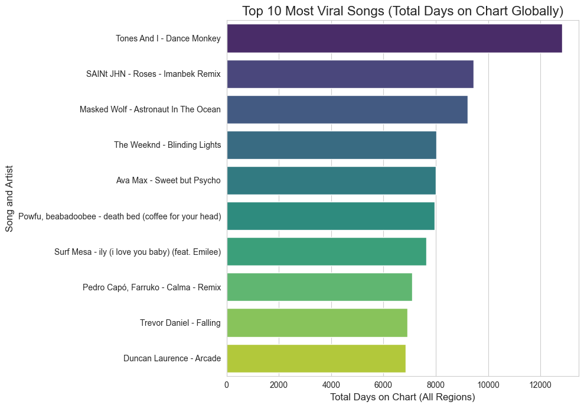
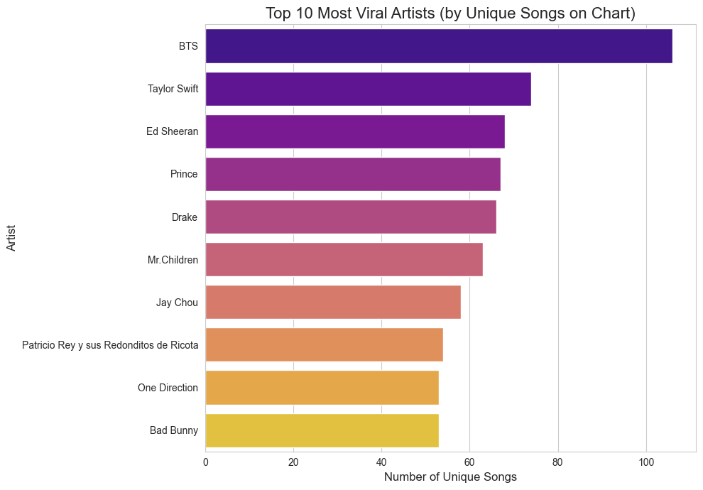
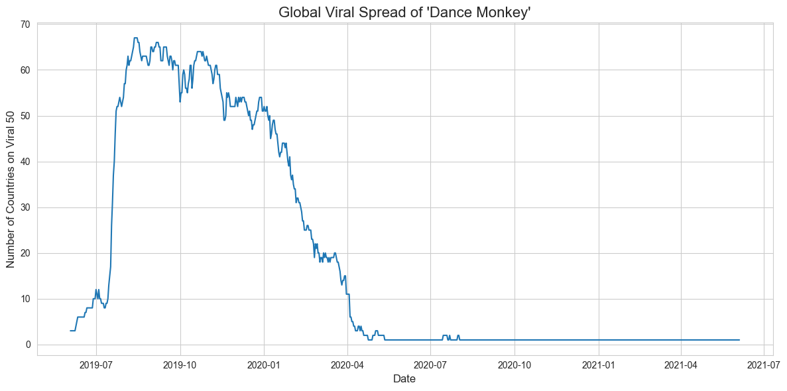

# 🎶 Spotify Viral Hits: Unpacking Global Music Trends 🎶

### Project Overview 🚀

Ever wondered what makes a song go viral on Spotify and how these trends catch fire across the globe? 🔥 This project dives into the **Spotify 'Daily Viral 50' charts** dataset from Kaggle to answer just that. I explored patterns in song popularity, identified top-performing artists, and tracked the global journey of a massive hit song.

---

### Key Questions Explored ❓

This analysis aimed to uncover insights into:

1.  **🏆 The All-Time Most Viral Songs:** Which tracks dominated the Viral 50 charts for the longest duration globally?
2.  **🧑‍🎤 The Most Viral Artists:** Which artists consistently landed the highest number of *unique* songs on the Viral 50?
3.  **📈 The Anatomy of a Global Hit:** How did a mega-hit like 'Dance Monkey' spread across different countries over time?

---

### Dataset 💾

* **Source:** [Spotify Charts Dataset on Kaggle](https://www.kaggle.com/datasets/dhruvildave/spotify-charts)
* **Key File Used:** `charts.csv` (Filtered for 'viral50')

---

### Tools Used 🛠️

* **Language:** Python
* **Libraries:**
    * `pandas` (Data manipulation and cleaning)
    * `matplotlib` & `seaborn` (Data visualization)
* **Environment:** Jupyter Notebook / Your IDE

---

### My Process ⚙️

1.  **Data Loading & Cleaning:** Loaded the large `charts.csv`, filtered specifically for the 'viral50' chart data, converted the 'date' column to the correct format, and dropped unnecessary columns.
2.  **Exploratory Data Analysis (EDA):** Grouped and aggregated data to identify top songs based on total days charted and top artists based on unique viral hits.
3.  **Time-Series Analysis:** Isolated data for a single hit song ('Dance Monkey') and tracked its daily presence across different countries.
4.  **Visualization:** Created bar charts and a line plot to visually represent the findings.

---

### Key Findings & Visualizations ✨

#### 1. Top 10 Most Viral Songs (Global Staying Power)

These songs spent the most total days listed on the Viral 50 charts across all tracked regions, demonstrating incredible longevity.

*(Chart showing the top 10 songs and their total days on the chart)*

#### 2. Top 10 Most Viral Artists (Consistency is Key)

These artists proved their ability to consistently produce hits, landing the highest number of *different* songs onto the Viral 50 charts.

*(Chart showing the top 10 artists and their count of unique viral songs)*

#### 3. The Global Spread of 'Dance Monkey' 🌍

Tracking 'Dance Monkey' revealed its explosive growth, peaking simultaneously on the Viral 50 charts in nearly 70 countries before gradually fading. This showcases the wave-like nature of global music trends.

*(Line chart showing the number of countries 'Dance Monkey' was viral in over time)*

---

### Conclusion 💡

This analysis highlights fascinating patterns in music virality. Some songs achieve massive, sustained global reach, while certain artists demonstrate a knack for repeatedly capturing the viral spotlight with multiple tracks. Tracking individual song trajectories provides a clear view of how trends propagate worldwide.

---

*(Optional: Add sections like "Future Work" or "How to Run This Code" if you like)*
